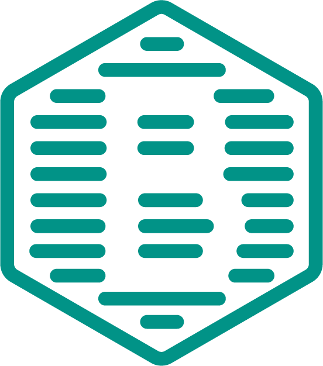

<p align="center">
  
  <h1>Beegrid</h1>
  A microframework based on CSS Grid Layout to build various types of grids thanks to a twelve column system, five default responsive tiers, Sass variables and mixins, and dozens of predefined classes to organize your content.
</p>

## Table of contents

- [Quick start](#quick-start)
- [CSS Files](#css-files)
- [Bugs and feature requests](#bugs-and-feature-requests)
- [Documentation](#documentation)
- [Contributing](#contributing)
- [Creators](#creators)
- [Copyright and license](#copyright-and-license)

## Quick start

Several quick start options are available:

- [Download the latest release.](https://github.com/davidedantonio/bee-grid/archive/master.zip)
- Clone the repo: `https://github.com/davidedantonio/bee-grid.git`
- Install with [npm](https://www.npmjs.com/): `npm install beegrid`
- Install with [yarn](https://yarnpkg.com/): `yarn add beegrid@1.0.0-rc-1`

## CSS Files

Within the download you'll find the following directories and files, providing both compiled and minified variations. You'll see something like this:

```
bee-grid/
└── css/
    ├── bee-grid.css
    ├── bee-grid.css.map
    ├── bee-grid.min.css
    └── bee-grid.min.css.map
```

## Bugs and feature requests

Have a bug or a feature request? Search for existing and closed issues. If your problem or idea is not addressed yet, [please open a new issue](https://github.com/davidedantonio/bee-grid/issues/new).

## Documentation

Beegrid's documentation, included in this repo in the root directory, is built with [Jekyll](https://jekyllrb.com/) and publicly hosted on GitHub Pages at <https://beegrid.com/>. The docs may also be run locally.

### Running documentation locally

1. Iinstall Jekyll (the site builder) and other Ruby dependencies with `bundle install`.
2. Run `npm install` to install Node.js dependencies.
3. Run `npm run test` (or a specific NPM script) to rebuild distributed CSS and JavaScript files, as well as our docs assets.
4. From the root `/bee-grid` directory, run `npm run docs-serve` in the command line.
5. Open `http://localhost:9001` in your browser, and voilà.

Learn more about using Jekyll by reading its [documentation](https://jekyllrb.com/docs/home/).

## Contributing

Solutions and improvements are always accepted. Please create a pull request [here](https://github.com/davidedantonio/bee-grid/)

## Creators

**Davide D'Antonio**

- <https://twitter.com/davidedantonio>
- <https://github.com/davidedantonio>

## Copyright and license
Code released under the [MIT License](https://github.com/davidedantonio/bee-grid/blob/master/LICENSE).